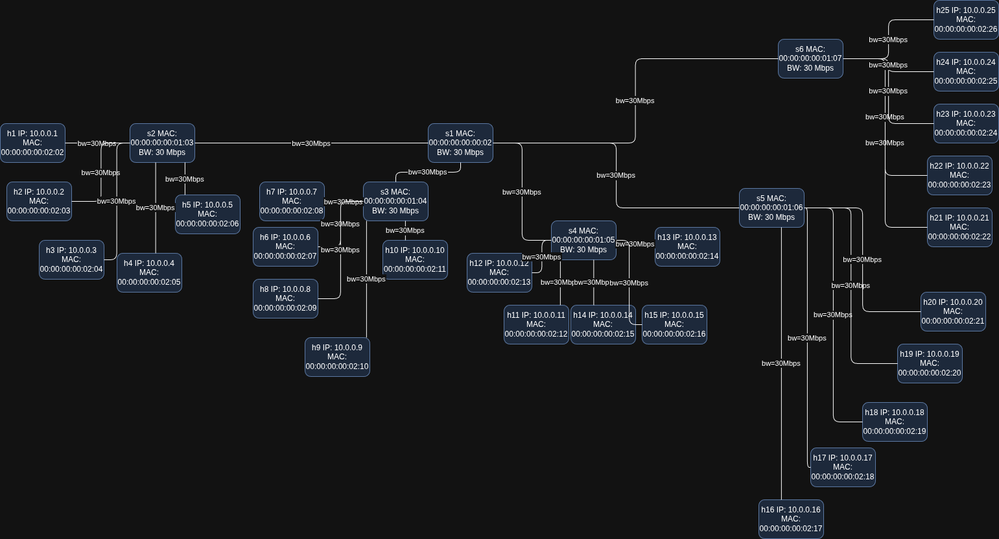
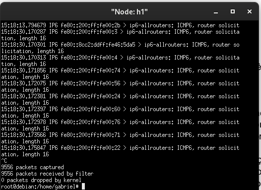
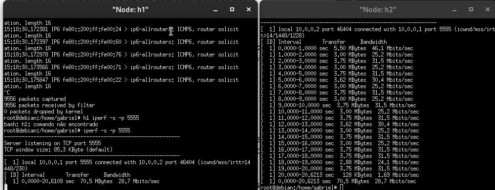
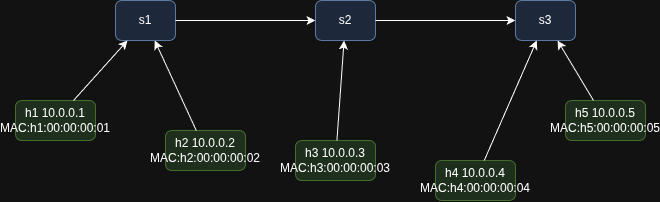

#  Trabalho Final – Mininet

Disciplina: Conceitos e Tecnologias de Dispositivos Conectados

Aluno: Gabriel Simões

Sistema: Debian 12

Simulador: Mininet

## Questão 1

🧠 Objetivo

Criar e analisar uma topologia em árvore (tree) com profundidade 3 e ramificação 5, utilizando o Mininet para testar conectividade, largura de banda e comportamento de rede entre hosts.

 ## ⚙️ a. Criação da topologia
🧾 Comando executado:
```
sudo mn --topo tree,depth=3,fanout=5 --mac --link tc,bw=30
```
- Explicação:

--topo tree,depth=3,fanout=5 → cria uma topologia em árvore com 3 níveis e 5 ramos por switch.

--mac → define endereços MAC automáticos e padronizados.

--link tc,bw=30 → define a largura de banda dos links como 30 Mbps.


## 🔍 b. Inspeção das interfaces e informações de rede

Após a inicialização do Mininet, os comandos abaixo para foram utilizados para obter as informações:
```
nodes
net
dump
```

Esses comandos mostram:

Lista de hosts e switches

Conexões entre nós

Endereços IP, MAC e portas


## 🖼️ c. Diagrama da topologia




## d. Teste de conectividade (Ping e Tcpdump)
🔹 Teste de ping entre todos os nós:
```
pingall
```

🔹 Captura de pacotes (tcpdump):




## ⚡ e. Teste TCP com iperf
🔸 Servidor (Host 1):
h1 iperf -s -p 5555

🔸 Cliente (Host 2):
h2 iperf -c 10.0.0.1 -p 5555 -t 20 -i 1




Para testar outro cenário, reinicie o Mininet com:

sudo mn -c
sudo mn --topo tree,depth=3,fanout=5 --mac --link tc,bw=40

![e2](Questão_1/e2.png

#### Obs: Processo inteiro se encontra em results.txt


## Questão 2 

## ⚙️ a. Estrutura da Topologia

A topologia foi definida através do script `topology.py`:
```
sudo python3 topology.py
```
## 🔍 b. Inspeção das interfaces e informações de rede

Após a inicialização do Mininet, use os comandos abaixo para obter as informações:
```
mininet> nodes
available nodes are: 
h1 h2 h3 h4 h5 s1 s2 s3
mininet> net
h1 h1-eth0:s1-eth1
h2 h2-eth0:s1-eth2
h3 h3-eth0:s2-eth3
h4 h4-eth0:s3-eth2
h5 h5-eth0:s3-eth3
s1 lo:  s1-eth1:h1-eth0 s1-eth2:h2-eth0 s1-eth3:s2-eth1
s2 lo:  s2-eth1:s1-eth3 s2-eth2:s3-eth1 s2-eth3:h3-eth0
s3 lo:  s3-eth1:s2-eth2 s3-eth2:h4-eth0 s3-eth3:h5-eth0
mininet> dump
<Host h1: h1-eth0:10.0.0.1 pid=109655> 
<Host h2: h2-eth0:10.0.0.2 pid=109657> 
<Host h3: h3-eth0:10.0.0.3 pid=109659> 
<Host h4: h4-eth0:10.0.0.4 pid=109661> 
<Host h5: h5-eth0:10.0.0.5 pid=109663> 
<OVSSwitch s1: lo:127.0.0.1,s1-eth1:None,s1-eth2:None,s1-eth3:None pid=109668> 
<OVSSwitch s2: lo:127.0.0.1,s2-eth1:None,s2-eth2:None,s2-eth3:None pid=109671> 
<OVSSwitch s3: lo:127.0.0.1,s3-eth1:None,s3-eth2:None,s3-eth3:None pid=109674> 
mininet> 
```

## 🖼️ c. Diagrama da topologia




## d. Teste de conectividade (Ping)
🔹 Teste de ping entre todos os nós:
```
pingall
```
```
*** Ping: testing ping reachability
h1 -> h2 h3 h4 h5
h2 -> h1 h3 h4 h5
h3 -> h1 h2 h4 h5
h4 -> h1 h2 h3 h5
h5 -> h1 h2 h3 h4
*** Results: 0% dropped (20/20 received)
```
## ⚙️ e. Criar regras MAC específicas

Limpeza das regras anteriores: 
```
sh ovs-ofctl del-flows s1
sh ovs-ofctl del-flows s2
sh ovs-ofctl del-flows s3
```
Descobrir endereço MAC: 
```
mininet> h1 ifconfig
h1-eth0: flags=4163<UP,BROADCAST,RUNNING,MULTICAST>  mtu 1500
        inet 10.0.0.1  netmask 255.255.255.0  broadcast 10.0.0.255
        inet6 fe80::70ed:c7ff:fe47:7416  prefixlen 64  scopeid 0x20<link>
        ether 72:ed:c7:47:74:16  txqueuelen 1000  (Ethernet)
        RX packets 31  bytes 4642 (4.5 KiB)
        RX errors 0  dropped 0  overruns 0  frame 0
        TX packets 25  bytes 1510 (1.4 KiB)
        TX errors 0  dropped 0 overruns 0  carrier 0  collisions 0

lo: flags=73<UP,LOOPBACK,RUNNING>  mtu 65536
        inet 127.0.0.1  netmask 255.0.0.0
        inet6 ::1  prefixlen 128  scopeid 0x10<host>
        loop  txqueuelen 1000  (Loopback Local)
        RX packets 4  bytes 448 (448.0 B)
        RX errors 0  dropped 0  overruns 0  frame 0
        TX packets 4  bytes 448 (448.0 B)
        TX errors 0  dropped 0 overruns 0  carrier 0  collisions 0
mininet> h5 ifconfig
h5-eth0: flags=4163<UP,BROADCAST,RUNNING,MULTICAST>  mtu 1500
        inet 10.0.0.5  netmask 255.255.255.0  broadcast 10.0.0.255
        inet6 fe80::38b9:2fff:fe43:1b7  prefixlen 64  scopeid 0x20<link>
        ether 3a:b9:2f:43:01:b7  txqueuelen 1000  (Ethernet)
        RX packets 31  bytes 4642 (4.5 KiB)
        RX errors 0  dropped 0  overruns 0  frame 0
        TX packets 25  bytes 1510 (1.4 KiB)
        TX errors 0  dropped 0 overruns 0  carrier 0  collisions 0

lo: flags=73<UP,LOOPBACK,RUNNING>  mtu 65536
        inet 127.0.0.1  netmask 255.0.0.0
        inet6 ::1  prefixlen 128  scopeid 0x10<host>
        loop  txqueuelen 1000  (Loopback Local)
        RX packets 4  bytes 448 (448.0 B)
        RX errors 0  dropped 0  overruns 0  frame 0
        TX packets 4  bytes 448 (448.0 B)
        TX errors 0  dropped 0 overruns 0  carrier 0  collisions 0
```
Adicionar regras: 
```
mininet> sh ovs-ofctl add-flow s1 "dl_src=72:ed:c7:47:74:16,actions=normal"
mininet> sh ovs-ofctl add-flow s3 "dl_dst=3a:b9:2f:43:01:b7,actions=normal"

```

## ⚡ e. Teste

```
mininet> h1 ping -c 3 h5
```
```
PING 10.0.0.5 (10.0.0.5) 56(84) bytes of data.
64 bytes from 10.0.0.5: icmp_seq=1 ttl=64 time=1.23 ms
64 bytes from 10.0.0.5: icmp_seq=2 ttl=64 time=1.10 ms
64 bytes from 10.0.0.5: icmp_seq=3 ttl=64 time=1.09 ms

--- 10.0.0.5 ping statistics ---
3 packets transmitted, 3 received, 0% packet loss, time 2002ms
rtt min/avg/max/mdev = 1.09/1.14/1.23/0.06 ms
```


