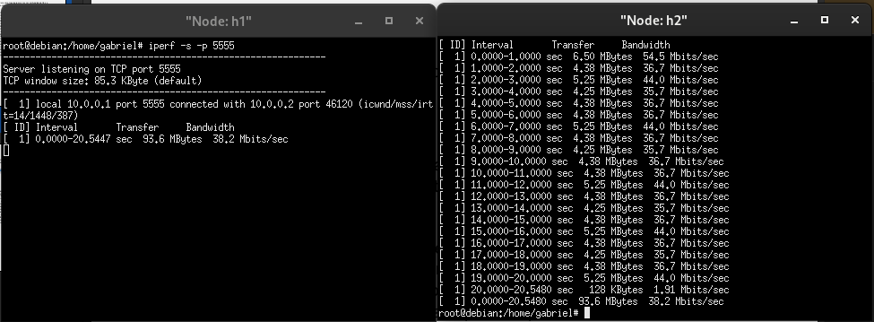

# 🧩 Trabalho Final – Mininet

Disciplina: Conceitos e Tecnologias de Dispositivos Conectados
Aluno: Gabriel Simões
Sistema: Debian 12
Simulador: Mininet

## Questão 1

🧠 Objetivo

Criar e analisar uma topologia em árvore (tree) com profundidade 3 e ramificação 5, utilizando o Mininet para testar conectividade, largura de banda e comportamento de rede entre hosts.

⚙️ a. Criação da topologia
🧾 Comando executado:
```
sudo mn --topo tree,depth=3,fanout=5 --mac --link tc,bw=30
```
🧩 Explicação:

--topo tree,depth=3,fanout=5 → cria uma topologia em árvore com 3 níveis e 5 ramos por switch.

--mac → define endereços MAC automáticos e padronizados.

--link tc,bw=30 → define a largura de banda dos links como 30 Mbps.


🔍 b. Inspeção das interfaces e informações de rede

Após a inicialização do Mininet, use os comandos abaixo para obter as informações:
```
nodes
net
dump
```

Esses comandos mostram:

Lista de hosts e switches

Conexões entre nós

Endereços IP, MAC e portas


🖼️ c. Diagrama da topologia


🧪 4. Teste de conectividade (Ping e Tcpdump)
🔹 Teste de ping entre todos os nós:
```
pingall
```

🔹 Captura de pacotes (tcpdump):


⚡ 5. Teste TCP com iperf
🔸 Servidor (Host 1):
h1 iperf -s -p 5555

🔸 Cliente (Host 2):
h2 iperf -c 10.0.0.1 -p 5555 -t 20 -i 1


Para testar outro cenário, reinicie o Mininet com:

sudo mn -c
sudo mn --topo tree,depth=3,fanout=5 --mac --link tc,bw=40


